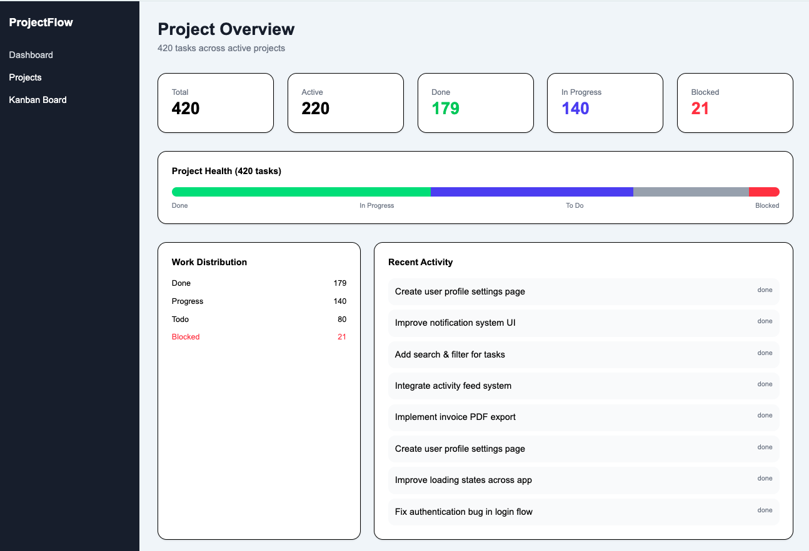
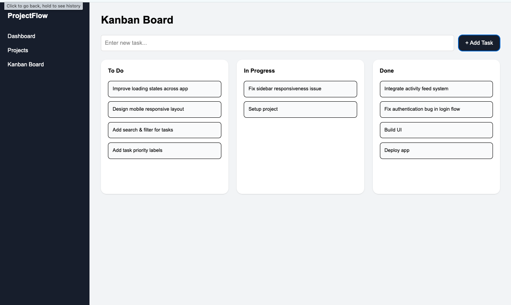

# 💸 ProjectFlow – Invoice & Billing System (SaaS Demo)

## 🌐 Live Demo
https://projectFlowui.netlify.app/

---

## 📌 Overview

ProjectFlow is a modern invoice and billing management system designed for freelancers, consultants, agencies, and small-to-medium service businesses.

It replaces manual invoicing methods (Excel sheets, Word templates, PDFs, handwritten invoices) with a centralized cloud-based billing platform.

The goal is to simplify invoice creation, automate payment tracking, and improve business cash flow.

---

## 🎯 Problem It Solves

Many small businesses still manage invoices manually, leading to:

- Late payments
- Missing invoices
- Poor payment visibility
- Tax calculation mistakes
- High administrative overhead
- Difficult financial reporting

---

## 💡 Solution

ProjectFlow centralizes the billing workflow into one web platform:

- Create professional invoices instantly
- Track payment status in real time
- Manage clients and billing history
- Calculate tax automatically
- Monitor revenue and overdue invoices
- Export and share invoices digitally

---

## ⚙️ Core Features

### 🧾 Invoice Management
- Create invoices with line items
- Edit and update invoices
- Automatic subtotal, tax, and total calculation
- Currency support (EUR, PKR)
- Generate invoice numbers
- Invoice status tracking:
  - Paid
  - Unpaid
  - Overdue

### 👥 Client Management
- Add and manage clients
- Store billing details
- Track invoice history per client
- Search and filter clients

### 📊 Analytics Dashboard
- Revenue overview
- Paid vs unpaid invoices
- Monthly income trends
- Overdue payment insights
- Business performance metrics

---

## 🔐 Authentication & Roles

- JWT-based authentication
- Role-based access control:
  - Admin
  - Accountant
  - Staff

---

## 💳 Billing System Features

- Prevents duplicate invoice numbers
- Auto-calculates VAT/tax
- Supports recurring invoices
- Tracks payment deadlines
- Sends payment reminders
- Maintains invoice history

---

## 🧱 Tech Stack

### Frontend
- React (Vite)
- TypeScript
- React Router
- TailwindCSS

### Backend
- Node.js
- Express.js
- Prisma ORM

### Database
- PostgreSQL

### Authentication
- JWT
- Bcrypt

### Deployment
- Frontend: Netlify
- Backend: Railway / Render
- Database: Supabase PostgreSQL

---

## 🏗 Architecture

Frontend (React)  
→ REST API (Express)  
→ Database (PostgreSQL)  
→ Email Service (Nodemailer)  
→ PDF Generator

---

## 📊 Business Value

This system helps businesses:

- Save 4–8 hours/week on billing tasks
- Reduce invoicing mistakes by 40%+
- Improve payment collection speed
- Increase financial visibility
- Improve cash flow management

---

## 📱 Screens Included (Portfolio)

- Login / Register
- Dashboard
- Create Invoice
- Invoice Management
- Client Management
- Analytics Dashboard
- Settings / Tax Configuration
- Mobile Responsive View

---

## 🚀 Future Enhancements

- PDF invoice export
- Stripe payment links
- Email invoice delivery
- Automatic recurring invoices
- Multi-currency support
- AI revenue forecasting
- Expense tracking

---

## 👨‍💻 Project Status

✔ Production-ready portfolio project  
✔ Fully functional frontend + backend architecture  
✔ Scalable SaaS foundation  

---

## 👤 Author

Daniyal Tariq  
Web Apps Developer for Finnish SMEs | React | Node.js | SaaS Systems